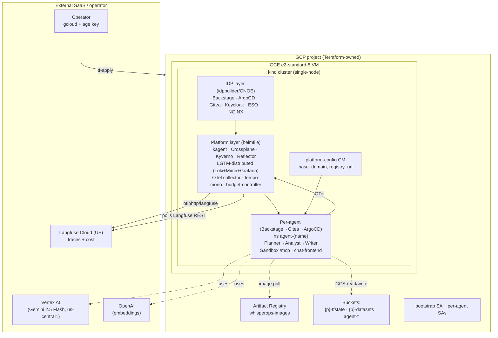

# WhisperOps — Dataset Whisperer Platform

An Internal Developer Platform that ships isolated, governed, observable Data Analyst agents over curated datasets. Operators provision agents through a Backstage self-service form; each agent gets a sandboxed Python execution environment, per-agent GCS bucket, LLM budget enforcement, and a chat UI — all GitOps-driven.

## Quick start

```bash
# 1. One-time per machine: authenticate gcloud.
#    No SOPS/age key required — see docs/SECRETS.md for the credential model.
gcloud auth application-default login

# 2. Edit terraform/envs/demo/{terraform,backend}.tfvars with your project_id + tfstate bucket.

# 3. Full deploy on a fresh GCP project (~25 min)
make deploy

# 4. Smoke-test
make smoke-test
```

The full deploy chain is documented in [`docs/OPERATIONS.md`](docs/OPERATIONS.md). Read it before re-running on a clean cluster — there is order-of-operations subtlety the Makefile alone does not capture.

## Architecture at a glance

The platform installs in three sequential layers: cloud floor → IDP → application platform. Per-agent stacks are GitOps-reconciled by ArgoCD; the platform layer itself is direct-helmfile.



Architectural specifics worth knowing up front:

- **Per-agent isolation** — each agent lives in its own `agent-{name}` namespace with a dedicated GCS bucket, GCP service account, SA key, sandbox pod, chat-frontend pod, and Ingress. No shared sandbox pool.
- **3-agent A2A** — Planner orchestrates Analyst (compute via the per-agent sandbox `execute_python` MCP tool) and Writer (markdown prose). All three reference the same `model` ModelConfig (Gemini 2.5 Flash via Vertex AI).
- **Two install layers** of the platform: cloud floor (Terraform) and application platform (helmfile, then ArgoCD app-of-apps takes over for per-agent stacks).
- **Two-pane observability** — Langfuse Cloud (LLM ops view) plus LGTM in-cluster (Mimir/Tempo/Loki/Grafana) for infra and traces. The OTel collector dual-exports.
- **Sed-bake at template-publish** — `base_domain` and `project_id` are hidden, sed-baked into the Backstage scaffolder template by `_vm-bootstrap` from the live VM IP and project ID. The operator only sees `agent_name`, `description`, `dataset_id`, `budget_usd`.
- **Bootstrap SA key is ephemeral** — generated fresh per deploy via `make gcp-bootstrap-key`. Not stored in `secrets/`.
- **Vertex SA key is ephemeral** — generated fresh per deploy via `make kagent-vertex-key`. Applied as Secret `kagent-vertex-credentials` in `kagent-system`, Reflector-replicated to `agent-*`. Mounted on the kagent `app` container for ADC-authenticated Vertex AI inference.
- **`ar-pull-secret` is auto-managed** — Reflector replicates from a source Secret in `crossplane-system`, with a 30-min token-rotation CronJob.

## Documentation

| Doc | Purpose |
|---|---|
| [`docs/OPERATIONS.md`](docs/OPERATIONS.md) | **Operator handbook** — deploy chain, Backstage agent lifecycle, observability navigation. Start here. |
| [`docs/ARCHITECTURE.md`](docs/ARCHITECTURE.md) | System architecture — components, request flow, trust boundaries |
| [`docs/SECURITY.md`](docs/SECURITY.md) | Security model — isolation, secrets, residual risks |
| [`docs/SECRETS.md`](docs/SECRETS.md) | **Credentials inventory** — what each Kubernetes Secret holds, where it comes from (Terraform / Makefile / Langfuse UI), how it rotates |
| [`docs/runbooks/incident-response.md`](docs/runbooks/incident-response.md) | Incident procedures (budget breach, sandbox failures, Crossplane stuck) |
| `.claude/sdd/features/DESIGN_whisperops.md` | Full architecture spec. Internal-only. |
| `.claude/sdd/features/DEFINE_whisperops.md` | Acceptance tests, success criteria. Internal-only. |
| `.claude/sdd/features/PENDING_whisperops.md` | Internal backlog of in-flight bugs, deferred features, open product decisions |
| `tests/smoke/` | `platform-up.sh`, `agent-creation.sh`, `query-roundtrip.sh`. |

## Prerequisites

| Tool | Version | Purpose |
|---|---|---|
| `terraform` | ≥ 1.7 | Cloud floor |
| `gcloud` | latest | GCP auth |
| `kubectl` | ≥ 1.29 | Cluster interaction |
| `helm` | ≥ 3.14 | Chart rendering |
| `helmfile` | ≥ 0.163 | Platform bootstrap |
| `yq` | ≥ 4 | Required by some Make targets |
| `jq` | any | Smoke tests + secret repair |
| `make` | any | Task runner |
| `node` | ≥ 20 | Backstage / TS chat-frontend |
| `python` | 3.12 | Sandbox + budget-controller |

### DNS prerequisite

In-cluster idpbuilder uses `cnoe.localtest.me` as routing hostname (a public DNS entry pointing at `127.0.0.1`). Most networks resolve this automatically. Verify:

```bash
dig +short cnoe.localtest.me   # expected: 127.0.0.1
```

If your network filters/rewrites public DNS:

```bash
echo "127.0.0.1 cnoe.localtest.me argocd.cnoe.localtest.me gitea.cnoe.localtest.me backstage.cnoe.localtest.me" \
  | sudo tee -a /etc/hosts
```

External browser access uses sslip.io URLs, which require no DNS configuration.

## Surface URLs (post-deploy)

After `make deploy`, fetch the live VM IP:

```bash
VM_IP=$(gcloud compute instances describe whisperops-vm --zone=us-central1-a \
  --format='value(networkInterfaces[0].accessConfigs[0].natIP)')
```

| Surface | URL pattern |
|---|---|
| Backstage | `https://backstage.${VM_IP}.sslip.io:8443/` |
| ArgoCD | `https://argocd.${VM_IP}.sslip.io:8443/` |
| Gitea | `https://gitea.${VM_IP}.sslip.io:8443/` |
| Grafana | `https://grafana.${VM_IP}.sslip.io:8443/` |
| Per-agent chat | `https://agent-<name>.${VM_IP}.sslip.io:8443/` |
| Langfuse Cloud (external SaaS) | `https://us.cloud.langfuse.com/` |

Backstage SSO via Keycloak requires an SSH tunnel — see [`docs/OPERATIONS.md`](docs/OPERATIONS.md) for the tunnel command.

## Makefile targets

| Target | Description |
|---|---|
| `make preflight` | Verify gcloud, tfvars, APIs, tfstate bucket, DNS |
| `make deploy` | Full rollup: preflight → tf-apply → upload-datasets → copy-repo → ephemeral SA keys → build-images → deploy-vm |
| `make destroy FORCE=1 PROJECT_ID=<id>` | Full teardown: empty buckets → drain Crossplane → drop Argo CRDs → orphan firewalls → terraform destroy → orphan IAM cleanup |
| `make smoke-test` | Assert platform up, agents reachable, ArgoCD healthy (runs on VM via SSH) |
| `make kagent-vertex-key` | Generate fresh Vertex SA key and apply as Secret `kagent-vertex-credentials` in `kagent-system` |
| `make tempo-gcs-key` / `make grafana-gcm-key` / `make langfuse-pg-key` | Generate fresh observability SA keys and apply as Secrets in `observability` ns |
| `make external-ingresses VM_IP=<ip>` | Regenerate sslip.io ingresses for the current VM IP |
| `make upload-datasets` | Upload `datasets/*.csv` to `gs://whisperops-datasets/` (also auto-invoked by `make deploy`) |
| `make lint` | Run all linters (ruff, mypy, tsc, helm lint, terraform validate) |
| `make help` | List all targets |

## Datasets

| Dataset | Source | Size (CSV) |
|---|---|---|
| California Housing | Kaggle | 1.4 MB |
| Online Retail II | UCI ML Repository | 95 MB |
| Spotify Tracks | Kaggle | 20 MB |

The three CSVs ship under `datasets/` and are uploaded to `gs://<project>-datasets/` automatically by `make deploy` (idempotent via `--no-clobber`).

## Security notes

- No credentials are stored in git. SA keys are generated fresh per `make deploy` from Terraform-managed service accounts; Langfuse application keys are issued by the operator inside the in-cluster Langfuse UI.
- Sandbox pods run with `readOnlyRootFilesystem`, no SA token mount, 4 Gi memory cap, NetworkPolicy egress restricted to GCS + DNS + the in-cluster OTel collector.
- Per-agent GCP SA is scoped to its own bucket (admin) and the shared datasets bucket (read). Cross-namespace pod-to-pod traffic denied by Kyverno-generated NetworkPolicy.
- Bootstrap SA bindings are unconditional (IAM Conditions can't gate `*.create` operations because `resource.name` is empty at create time). The naming convention (`agent-*`) is enforced at the Backstage template level. Blast radius is bounded at "who can scaffold via Backstage."
- sslip.io reveals the VM IP in every hostname — acceptable for a prototype, replace with real wildcard DNS for production.

## License

MIT
