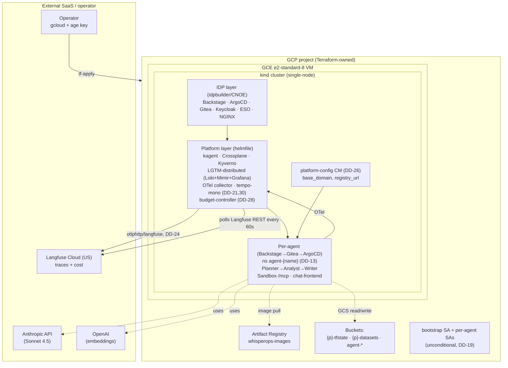

# WhisperOps — Dataset Whisperer Platform

An Internal Developer Platform that ships isolated, governed, observable Data Analyst agents over curated datasets. Operators provision agents through a Backstage self-service form; each agent gets a sandboxed Python execution environment, per-agent GCS bucket, LLM budget enforcement, and a chat UI — all GitOps-driven.

## Quick start

```bash
# 1. One-time: place ./age.key (out-of-band), customise terraform/envs/demo/{terraform,backend}.tfvars
export SOPS_AGE_KEY_FILE=$PWD/age.key

# 2. Cloud floor + IDP layer (~10-12 min on a fresh GCP project)
make tf-apply PROJECT_ID=<your-project-id>

# 3. Follow docs/OPERATIONS.md §1 from Stage 2 onward (VM bootstrap → platform layer → secrets → datasets → ingresses → first agent)
```

The full deploy is documented stage-by-stage in [`docs/OPERATIONS.md`](docs/OPERATIONS.md). Read it before re-running on a clean cluster — there is order-of-operations subtlety that the Makefile alone does not capture.

## Architecture at a glance

The platform installs in three sequential layers (see DESIGN DD-27): cloud floor → IDP → application platform. Per-agent stacks are GitOps-reconciled by ArgoCD; the platform layer itself is direct-helm in v0.3.



Decision pointers worth knowing up front:

- **DD-12** — sandbox is per-agent (one Deployment per `agent-*` ns), not a shared pool. Credentials mounted from the agent's own namespace Secret.
- **DD-21 + DD-30** — `tempo-mono` is the sole tracing backend; lgtm-distributed Tempo sub-chart disabled.
- **DD-24 (v1.6)** — Langfuse Cloud (US) integration is active. Trace dual-export from OTel collector; Grafana Infinity datasource queries Langfuse REST.
- **DD-26** — `platform-config` ConfigMap is the single source of truth for the current VM IP feeding the Backstage scaffolder.
- **DD-28** — budget-controller deployed in v0.3; polls Langfuse REST primary, Mimir fallback; writes `whisperops.io/spend-usd` annotation; Kyverno blocks sessions at the budget cap.
- **DD-31** — kagent helmfile `postRender` (requires `yq`) guarantees exactly one `AUTOGEN_DISABLE_RUNTIME_TRACING=false` env entry on the kagent Deployment.

## Documentation

| Doc | Purpose |
|---|---|
| [`docs/OPERATIONS.md`](docs/OPERATIONS.md) | **Operator handbook** — full stage-by-stage deploy, Backstage agent flow, observability navigation. Start here. |
| [`docs/ARCHITECTURE.md`](docs/ARCHITECTURE.md) | System architecture — components, request flow, trust boundaries |
| [`docs/SECURITY.md`](docs/SECURITY.md) | Security model — isolation, secrets, residual risks |
| [`docs/SECRETS.md`](docs/SECRETS.md) | **SOPS + age guide** — generate your own `age.key`, build each `secrets/*.enc.yaml` from your own credentials, materialization order |
| [`docs/runbooks/incident-response.md`](docs/runbooks/incident-response.md) | Budget-breach incident procedure (scaling, rotation, alert quieting) |
| `.claude/sdd/features/DESIGN_whisperops.md` | Full architecture spec + 31 decisions. **Internal-only and gitignored under `.claude/`.** |
| `.claude/sdd/features/DEFINE_whisperops.md` | Acceptance tests, success criteria. Internal-only and gitignored. |
| `tests/smoke/` | `platform-up.sh`, `agent-creation.sh`, `query-roundtrip.sh`. Set `IN_CLUSTER=1` for kubectl-port-forward mode (the practical default for the prototype). |

## Prerequisites

| Tool | Version | Purpose |
|---|---|---|
| `terraform` | ≥ 1.7 | Cloud floor |
| `gcloud` | latest | GCP auth |
| `age` + `sops` | latest | Secret encryption |
| `kubectl` | ≥ 1.29 | Cluster interaction |
| `helm` | ≥ 3.14 | Chart rendering |
| `helmfile` | ≥ 0.163 | Platform bootstrap |
| `yq` | ≥ 4 | Required for kagent postRender (DD-31) |
| `jq` | any | Smoke tests + secret repair |
| `make` | any | Task runner |
| `node` | ≥ 20 | Backstage / TS chat-frontend |
| `python` | 3.12 | Sandbox + bootstrap + budget-controller |

### DNS prerequisite

In-cluster idpbuilder uses `cnoe.localtest.me` as routing hostname (a public DNS entry pointing at `127.0.0.1`). Most networks resolve this automatically. Verify:

```bash
dig +short cnoe.localtest.me   # expected: 127.0.0.1
```

If your network filters/rewrites public DNS:

```bash
echo "127.0.0.1 cnoe.localtest.me argocd.cnoe.localtest.me gitea.cnoe.localtest.me backstage.cnoe.localtest.me" \
  | sudo tee -a /etc/hosts
```

External browser access uses sslip.io URLs (DD-23) instead, which require no DNS configuration.

## Surface URLs (post-deploy)

Once `make external-ingresses VM_IP=<vm-ip>` is applied and GCP firewall opens tcp:8443, five surfaces are reachable:

| Surface | URL pattern |
|---|---|
| Backstage | `https://backstage.<vm-ip>.sslip.io:8443/` |
| ArgoCD | `https://argocd.<vm-ip>.sslip.io:8443/` |
| Gitea | `https://gitea.<vm-ip>.sslip.io:8443/` |
| Grafana | `https://grafana.<vm-ip>.sslip.io:8443/` |
| Per-agent chat | `https://agent-<name>.<vm-ip>.sslip.io:8443/` |
| Langfuse Cloud (external SaaS) | `https://us.cloud.langfuse.com/` |

## Makefile targets

| Target | Description |
|---|---|
| `make preflight` | Verify gcloud, tfvars, APIs, tfstate bucket, DNS, SOPS keyfile, encrypted secrets |
| `make tf-apply PROJECT_ID=<id>` | Provision cloud floor (VPC, VM, buckets, AR, IAM) |
| `make platform-bootstrap` | Run the in-cluster dataset-profile Job (post-helmfile) |
| `make langfuse-secret` | Materialize `langfuse-credentials` Secret in `observability` ns (DD-29) |
| `make external-ingresses VM_IP=<ip>` | Regenerate sslip.io ingresses for the current VM IP (DD-23) |
| `make ar-pull-secret PROJECT_ID=<id>` | Refresh `ar-pull-secret` in all `agent-*` namespaces (DD-14; rerun ~hourly) |
| `make upload-datasets PROJECT_ID=<id>` | Upload `datasets/*.csv` to `gs://<id>-datasets/` |
| `make decrypt-secrets` | Decrypt `secrets/*.enc.yaml` → `secrets/*.dec.yaml` (gitignored) |
| `make smoke-test` | Run all three `tests/smoke/` scripts |
| `make destroy` | Tear down GCP infrastructure |

## Datasets

| Dataset | Source | Size (CSV) |
|---|---|---|
| California Housing | Kaggle | 1.4 MB |
| Online Retail II | UCI ML Repository | 95 MB |
| Spotify Tracks | Kaggle | 20 MB |

Upload with `make upload-datasets PROJECT_ID=<id>` after `make tf-apply` provisions the bucket.

## Security notes

- All secrets are SOPS+age encrypted in git — never commit plaintext keys.
- Sandbox pods run with `readOnlyRootFilesystem`, no SA token mount, 3 GB cgroup, NetworkPolicy egress restricted to GCS + DNS + the in-cluster OTel collector.
- Per-agent GCP SA is scoped to its own bucket (admin) and the shared datasets bucket (read). Cross-namespace pod-to-pod denied by Kyverno-generated NetworkPolicy.
- Bootstrap SA bindings are unconditional (DD-19): IAM Conditions don't gate `*.create` operations, so they were security-theatre. Naming convention (`agent-*`) is enforced at the Backstage template level.
- sslip.io reveals the VM IP in every hostname — acceptable for a prototype, replace with real wildcard DNS for production.

## License

MIT
